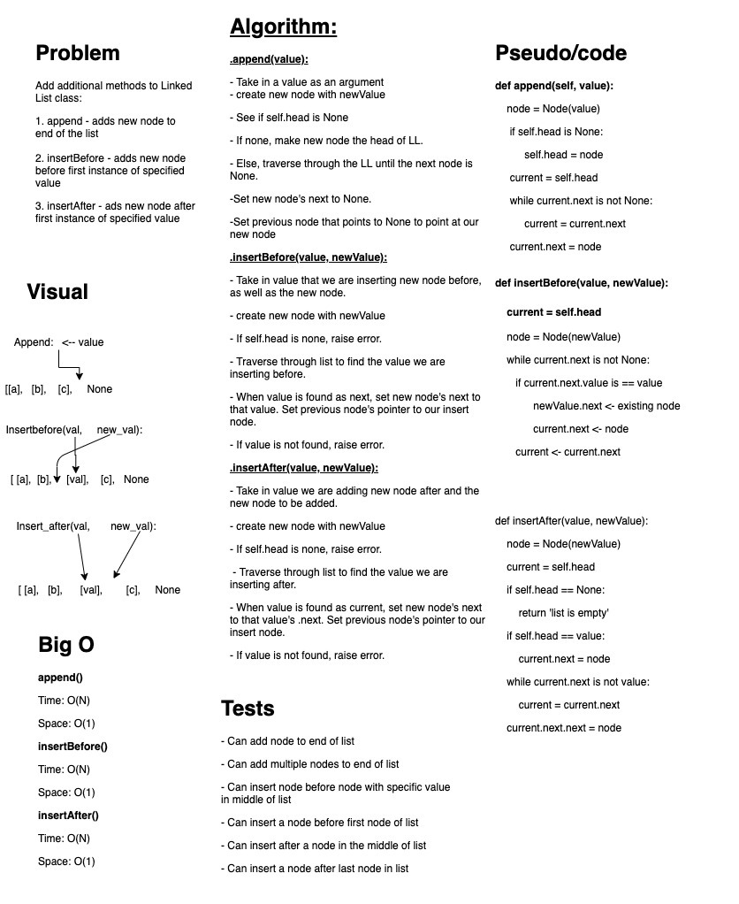
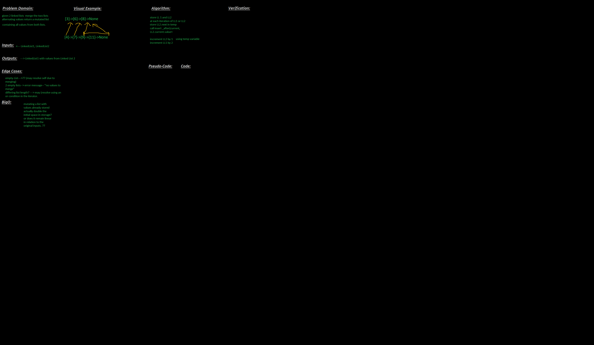
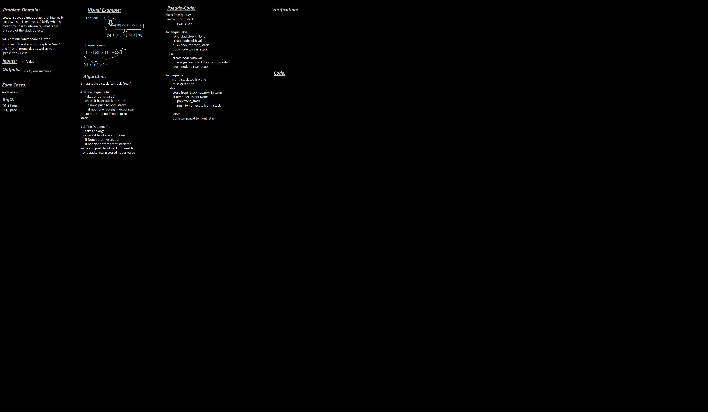
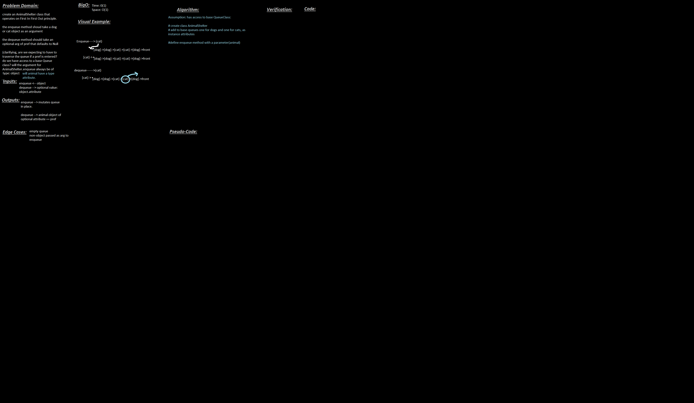
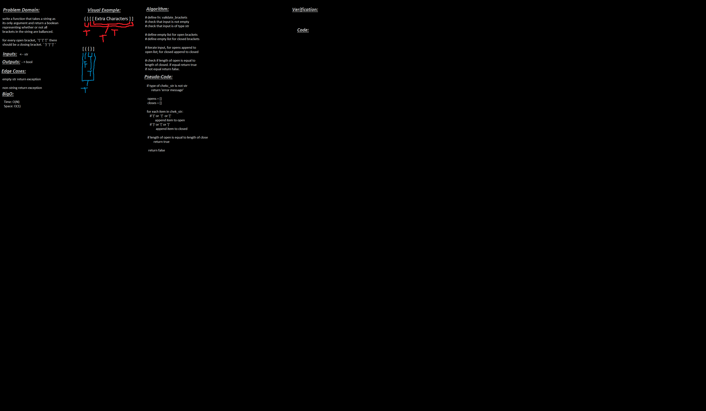
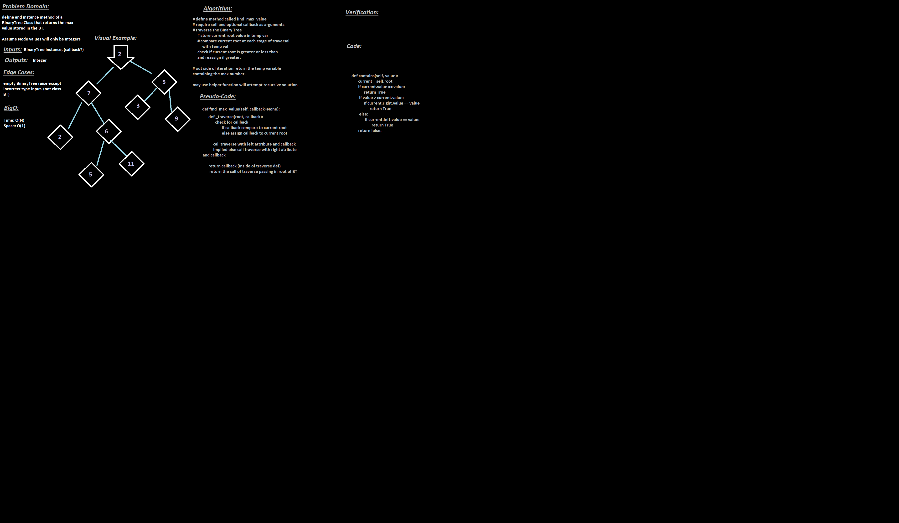
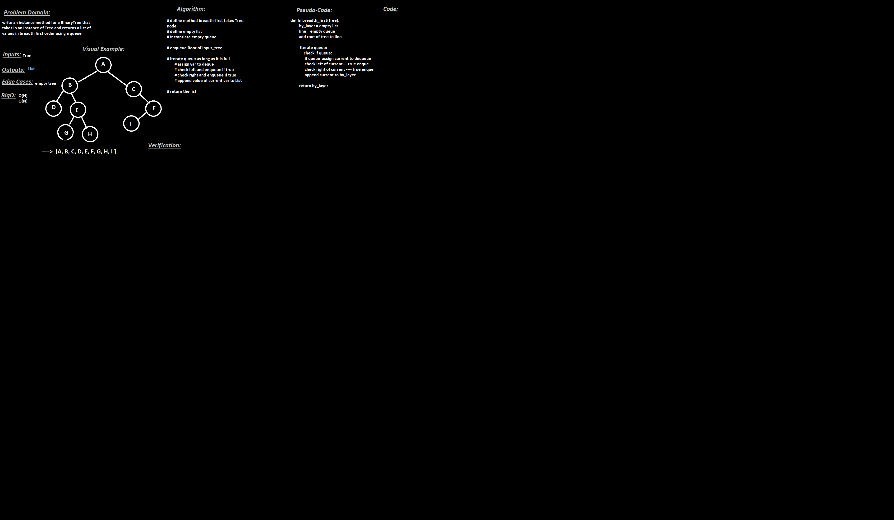
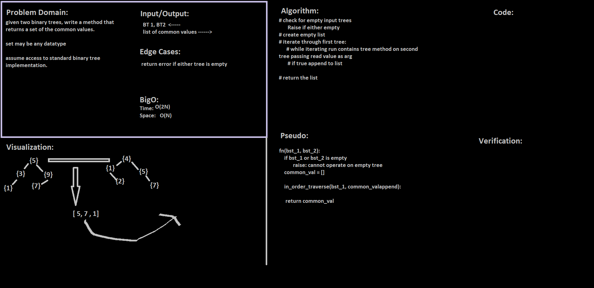
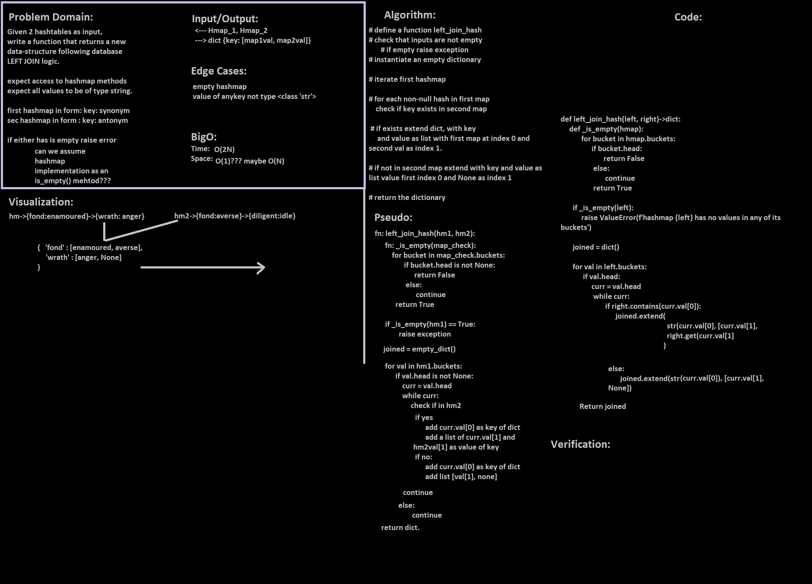

# Data Structures and Algorithms

## Language: `Python`

### Folder and Challenge Setup

Each type of code challenge has slightly different instructions. Please refer to the notes and examples below for instructions for each DS&A assignment type.

### Data Structure: New Implementation

- Create a new folder under the `python` level, with the name of the data structure and complete your implementation there
  - i.e. `linked_list`
- Implementation (the data structure "class")
  - The implementation of the data structure should match package name
    - i.e. `linked_list/linked_list.py`
  - Follow Python [naming conventions](https://www.python.org/dev/peps/pep-0008/#naming-conventions)

    ```python
    class LinkedList:
      def __init__(self):
        # ... initialization code

      def method_name(self):
        # method body
    ```

- Tests
  - Within folder `tests` create a test file called `test_[data_structure].py`
    - i.e. `tests/test_linked_list.py`
    - Your tests will then need to require the data structure you're testing
      - i.e. `from linked_list.linked_list import LinkedList`

### Data Structure: Extending an implementation

- Work within the existing data structure implementation
- Create a new method within the class that solves the code challenge
  - Remember, you'll have access to `self` within your class methods
- Tests
  - You will have folder named `tests` and within it, a test file called `test_[data_structure].py`
    - i.e. `tests/test_linked_list.py`
    - Add to the tests written for this data structure to cover your new method(s)

### Code Challenge / Algorithm

Code challenges should be completed within a folder named `code_challenges` under the `python` level

- Daily Setup:
  - Create a new folder under the `python` level, with the name of the code challenge
    - Each code challenge assignment identifies the branch name to use, for example 'find-maximum-value'
    - For clarity, create your folder with the same name, ensuring that it's `snake_cased`
    - i.e. For a challenge named 'find_maximum_value', create the folder:`code_challenges/find_maximum_value`
  - Code Challenge Implementation
    - Each code challenge requires a function be written, for example "find maximum value"
    - Name the actual challenge file with the name of the challenge, in `snake_case`
      - i.e. `find_maximum_value.py`
    - Reminder: Your challenge file will then need to require the data structure you're using to implement
      - i.e. `from linked_list.linked_list import LinkedList`
    - Your challenge function name is up to you, but name something sensible that communicates the function's purpose. Obvious is better than clever
      - i.e. `find_maximum_value(linked_list)`
  - Tests
    - Ensure there is a `tests` folder at the root of project.
      - i.e. a sibling of this document.
    - within it, a test file called `test_[challenge].py`
      - i.e. `tests/find_maximum_value.py`
      - Your test file would require the challenge file found in the directory above, which has your exported function
        - i.e. `from code_challenges.find_maximum_value import find_maximum_value`

## Running Tests

If you setup your folders according to the above guidelines, running tests becomes a matter of deciding which tests you want to execute.  Jest does a good job at finding the test files that match what you specify in the test command

From the root of the `data-structures-and-algorithms/python` folder, execute the following commands:

- **Run every possible test** - `pytest`
- **Run filtered tests** - `pytest -k some_filter_text`
- **Run in watch mode** - `ptw` or `pytest-watch`


## Challenges Index

[Challenge 02 w/ Amber Falboe](code_challenges/array_shift)

full whiteboard including pseudo code done in paint and png file shared with Amber Falbo. actual coding took about an hour largely due to technical issues. the code in the whiteboard was almost correct but had syntax errors that were corrected when entered in editor. 

*whiteboard image will not copy to project ERROR: unable to resolve non-existing file \<path\>*

[Challenge 05: Linked_List Implementation](https://github.com/MasonChance/data-structures-and-algorithms-1/pull/4)

[Challenge 06: LinkedList Insertions](https://github.com/MasonChance/data-structures-and-algorithms-1/pull/5)



Whiteboard and initial planning with Logan Jones, Alex angelico, Sean Hawkins

[Challenge 07: find-kth value PR](https://github.com/MasonChance/data-structures-and-algorithms-1/pull/6)


Whiteboard and initial planning with Logan Jones, Alex angelico, Sean Hawkins


[Challenge 08: zip-lists PR](https://github.com/MasonChance/data-structures-and-algorithms-1/pull/8)

***Intial WhiteBoard partnered with @LoganJones




[Challenge 11: queue with stacks PR](https://github.com/MasonChance/data-structures-and-algorithms-1/pull/10)


[Challenge 12: fifo_animal shelter](https://github.com/MasonChance/data-structures-and-algorithms-1/pull/11)



[Challenge 13: multi-bracked validation PR](https://github.com/MasonChance/data-structures-and-algorithms-1/pull/12)



[Binary Tree implementation]()

[Challenge 16: find_max_value](https://github.com/MasonChance/data-structures-and-algorithms-1/pull/14)
  


[Challenge 17: Breadth first search PR](https://github.com/MasonChance/data-structures-and-algorithms-1/pull/16)
 

[Challenge 18: K_ary_FizzBuzz](https://github.com/MasonChance/data-structures-and-algorithms-1/pull/17)


[Challenge 26: insert_sort](https://github.com/MasonChance/data-structures-and-algorithms-1/pull/18)

[Challenge 27](https://github.com/codefellows/data-structures-and-algorithms/pull/28)

[Challenge 30: Hashtable Implementation PR](https://github.com/MasonChance/data-structures-and-algorithms-1/pull/20)

[Challenge 30: Repeated-Word with Hash](https://github.com/MasonChance/data-structures-and-algorithms-1/pull/21)


[Challenge 32: Tree intersection](https://github.com/MasonChance/data-structures-and-algorithms-1/pull/22)



[Challenge 33: left-join-hashmap PR]()


